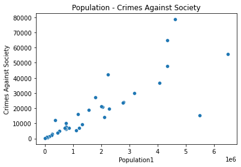

# US-Crime-2012-Data
About This project involves Analyses and Visualizations about US crime data related to assault offenses in all agency types

# Table of contents

<a href="#1">1. Data </a>  

<a href="#2">2. Exploratory Data Analysis </a> 

<a href="#3">3. Comparison of Crimes for States (2012)</a>  

<a href="#4">4. Some Relations Between datas </a> 

## 1. Data

The FBI collects the US assault offenses data through the UCR Program’s NIBRS. This table provides the number of offenses distributed by offense type. This table counts offense types using the following rules:
* Offenses – if the offense type in Data Element 6 (UCR Offense Code) is:
  * Crime Against Person: count one for each victim, i.e., Victim Segment.
  * Crime Against Property: count one for each unique offense type.
  * Crime Against Society: count one for each unique offense type.
* The data used in creating this table were from law enforcement agencies submitting 12 months of NIBRS data to the FBI UCR Program for 2012 and were converted and published in CIUS, 2012. Upon meeting both criteria, the agencies’ actual NIBRS submissions were used in this table.

## 2. Exploratory Data Analysis

- here are some graphs produced from this exercise
  
  - Population - Crimes Against Persons
  

    
  

- Population - Crimes Against Property
  

    
  

  - Population - Crimes Against Society
  

    
  

  - Heatmap
  

    
  

 ## 3. Comparison of Crimes for States (2012)
 
- Comparison of Crimes for States (2012)
- 
  

    
  

## 4. Some Relations Between datas

-  Crimes Against Persons - Crimes Against Property

 

    
  

-Burglary/ Breaking & Entering - Destruction/ Damage/ Vandalism

 

    
  

  
